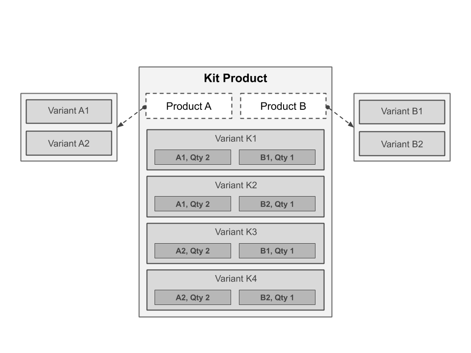

Workarea Product Bundles
================================================================================

A Workarea Commerce plugin that adds support for product bundles. A product bundle groups together other products to be displayed on a single product detail page. This enables your storefront to display related items together and offer an easy way to quickly add all the items to cart.

Features
--------------------------------------------------------------------------------

* Adds the ability to associate products through a product bundle in the admin
* Adds a custom product bundle creation workflow to the admin
* Adds a `package` product template for the storefront that displays all the packaged products together while still allowing separate add to cart buttons for each product
* Adds a `family` product template for the storefront that displays all the packaged products together and allows adding any or all bundled products to a cart at the same time
* Adds the concept of `kit` products, a product bundle that defines its own variants as specific combinations of bundled product SKUs, and displays as a single product through checkout.
* Adds the `defer_to_components` inventory policy which is used for kits to allow inventory to be determined by the SKUs which make up a particular kit variant.
* Adds the `skip` fulfillment policy which allows SKUs to skip the fulfillment process.

Getting Started
--------------------------------------------------------------------------------

Add the gem to your application's Gemfile:

```ruby
# ...
gem 'workarea-product_bundles'
# ...
```

Update your application's bundle.

```bash
cd path/to/application
bundle
```

Product Bundles
--------------------------------------------------------------------------------

A **product bundle** is a product that contains other products.

For some bundles, this is simply a way to display related products together on a single product detail page. In this plugin, we call those **discrete bundles**, which always show each individual product within the bundle and allow any or all of the products to be added to cart. Each individual product will show as a separate item in the cart and throughout checkout.

### Discrete Bundles

**Package**

A package product is the most basic product bundle type. A package displays bundled products on a single detail page where a customer can select options and add each individual product to their cart one at a time. Each product within a package product displays its own options, quantity, and add to cart button. The package product itself is never added directly to cart, but rather serves as a container of those related products.

**Family**

A family product provides greater flexibility and a simpler shopping experience for the customer that wishes to add any or all products within a bundle to their cart. Products bundled as a family are displayed with their own options and quantity selection. However, with family there is a single add to cart button that allows a customer to decide exactly which parts of the bundle they want to purchase and can then add them all to their cart with one click.

### Kits

Kits are a unique, **indiscrete bundle** type that combines specific SKUs from any number of its bundled products and builds its own variants from those combinations. Each variant of a kit has its own set of options and pricing that represents a specific combination of SKUs and quantities from the bundled products.

To a customer, a kit is displayed just like a normal product with a single set of options to select before adding the kit to their cart. The plugin provides you the option to show the bundled products, SKUs, and quantities to the customer after they make a selection, or leave that information hidden.

**Variant Components**

A variant made for a kit will have many components. Components define which SKUs a variant represents from among the bundled products. Additionally a component allows you to define a quantity, which allows a single kit variant to represent multiples of a single SKU.

To better visualize the relationship of kits and their bundled products, examine the following example:



This kit contains two bundled products, Product A and Product B. Each of these products has two variants. When the kit was constructed, four variants were created, representing each unique combination of variants of the bundled products. Each kit variant has two components, one representing a variant from Product A with a quantity of 2, and another component representing a variant from Product B.

The variants in the kit are represented to the customer like variants of a regular product from the detail page through checkout. Once an order containing a kit is placed, the items within the kit are expanded out of the kit to allow for proper tracking of each item's status through fulfillment.

Workarea Commerce Documentation
--------------------------------------------------------------------------------

See [https://developer.workarea.com](https://developer.workarea.com) for Workarea Commerce documentation.

License
--------------------------------------------------------------------------------

Workarea Product Bundles is released under the [Business Software License](LICENSE)
